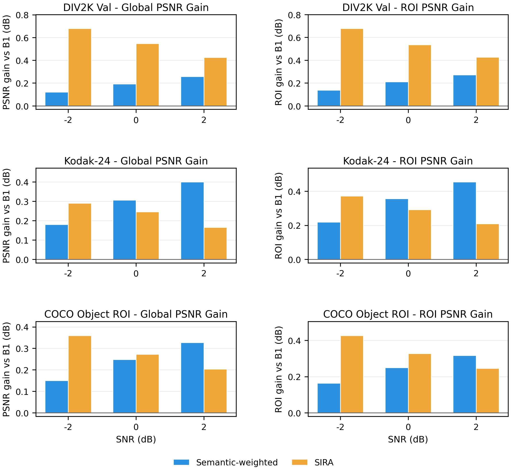

# SIRA: Semantic-Informed Reliability Adaptation for DeepJSCC

SIRA is a parameter-efficient adapter for semantic-aware image transmission over
noisy channels. It freezes a pretrained DeepJSCC encoder/decoder and learns a
spatial power-allocation policy from image semantics and channel conditions.

This repository is also an empirical study of when semantic protection helps,
when it saturates, and which parts of an adaptive communication module actually
contribute.



## What SIRA Does

```text
image x -> frozen encoder -> latent z -> spatial power allocation -> channel -> frozen decoder
              |                         ^
              +-> M: semantic map ------|
SNR ----------------> R: reliability ---+-> A: protection adapter
```

- **M, Semantic Prior Mapper:** predicts spatial importance from the input image.
- **R, Channel Reliability Mapper:** maps SNR to a reliability embedding and a
  power-allocation temperature.
- **A, Protection Adapter:** combines semantic and reliability information to
  produce a normalized spatial power map.

The encoder and decoder remain frozen for all SIRA variants.

## Implemented Methods

| Method | Backbone initialization | Trainable components |
|---|---|---|
| `cnn` | trained from scratch with MSE | encoder + decoder |
| `semantic` | trained from scratch with MSE + DINOv2-weighted reconstruction | encoder + decoder |
| `sira_b1_init` | `cnn` checkpoint | M + R + A |
| `sira_b2_init` | `semantic` checkpoint | M + R + A |
| `sira_b2_no_r` | `semantic` checkpoint | M + A |
| `sira` | legacy alias of `sira_b1_init` | M + R + A |

## Main Findings

- Semantic protection is most useful under constrained bandwidth (`c=2`) and
  low SNR; gains largely shrink when bandwidth is less constrained (`c=4`).
- The adapter depends on the representation quality of the frozen backbone.
  This repository therefore supports **backbone compatibility**, not a strong
  architecture-agnostic claim.
- Reusing DINOv2 semantics in both the semantic backbone and M leaves limited
  marginal improvement, suggesting diminishing returns from already-captured
  semantic information.
- Removing R produces nearly identical reconstruction quality. Sensitivity
  analysis shows that R changes the power-map pattern, but the allocation
  magnitude remains weak and does not consistently concentrate more power under
  poor channel conditions.

These are empirical findings from the included experimental setup, not claims
of universal behavior.

## Evaluation

Experiments cover:

- **DIV2K validation:** in-domain reconstruction.
- **Kodak-24:** zero-shot image-domain generalization.
- **COCO val2017:** object-ROI reconstruction using ground-truth bounding boxes.
- **AWGN channels:** SNR sweep `[-2, 0, 2, 5, 10, 15]` dB.
- **Metrics:** PSNR, SSIM, LPIPS, semantic ROI PSNR, and COCO object-ROI PSNR.

The tracked `results/` files contain representative exploratory runs. DeepJSCC
evaluation samples channel noise during inference. The evaluation scripts reset
the same seed before each method for matched-noise comparisons; serious
comparisons should still report repeated seeds with confidence intervals.

Training also resets the random state after model and DINOv2 initialization so
adapter variants receive matched data order, sampled SNRs, and channel-noise
sequences.

## Quick Start

### 1. Install

```bash
git clone https://github.com/vale817/SIRA-DeepJSCC.git
cd SIRA-DeepJSCC

python -m venv .venv
source .venv/bin/activate
pip install -r requirements.txt
```

CUDA is strongly recommended for training. Evaluation and visualization can run
on CPU, but will be slower.

Run the data-free structural test:

```bash
python -m scripts.smoke_test
```

### 2. Prepare Data

Expected layout:

```text
data/
  DIV2K/
    DIV2K_train_HR/
    DIV2K_valid_HR/
  kodak/
    kodim01.png ... kodim24.png
  coco/
    val2017/
    annotations/
      instances_val2017.json
```

`setup_and_run.sh` can download DIV2K. Kodak and COCO should be downloaded from
their official sources and placed in the layout above.

### 3. Configure DINOv2

By default, DINOv2 is loaded through `torch.hub`. For an existing local cache:

```bash
export SIRA_DINO_HUB_DIR=/path/to/torch_cache/hub
export SIRA_DINO_SOURCE=local
export SIRA_DINO_REPO_OR_DIR=/path/to/facebookresearch_dinov2_main
```

For a lightweight smoke test without DINOv2:

```bash
export SIRA_IMPORTANCE_MODE=edge
```

The edge mode is a debugging fallback and is not equivalent to the reported
DINOv2 experiments.

## Training

Train the two backbones first:

```bash
python -m scripts.train --latent_ch 2 --methods cnn semantic
```

Then train frozen-backbone adapters:

```bash
python -m scripts.train \
  --latent_ch 2 \
  --methods sira_b1_init sira_b2_init sira_b2_no_r \
  --allocation_mode hard \
  --batch_size 16
```

Existing checkpoints are skipped unless `--force` is passed. Best-validation
checkpoints are saved as `.pt`; final-epoch checkpoints use `_final.pt`.
`--allocation_mode hard` is the default KKT water-filling method. Use
`--allocation_mode soft` for the low-SNR stabilized sqrt-risk blend. Training
and evaluation must use the same allocation mode.

Multi-seed validation trains and evaluates each seed in its own checkpoint and
result directory, then writes mean/std summaries:

```bash
python -m scripts.run_multiseed \
  --seeds 42 43 44 \
  --latent_ch 2 \
  --methods cnn semantic sira_b1_init sira_b2_init sira_b2_no_r \
  --allocation_mode hard \
  --importance_mode dino
```

For a quick wiring check before the full run, use `--importance_mode edge`,
small epochs, and `--dry_run` first.

## Evaluation and Analysis

DIV2K and Kodak:

```bash
python -m scripts.eval \
  --latent_ch 2 \
  --methods cnn semantic sira_b1_init sira_b2_init sira_b2_no_r \
  --result_dir results/run_c2
```

COCO object ROI:

```bash
python -m scripts.eval_coco \
  --coco_root data/coco \
  --latent_ch 2 \
  --methods cnn semantic sira_b1_init sira_b2_init sira_b2_no_r \
  --result_dir results/run_c2
```

Low-SNR summary:

```bash
python -m scripts.plot_low_snr --latent_ch 2 --result_dir results/run_c2
```

Power-map visualization:

```bash
python -m scripts.visualize_power_map \
  --latent_ch 2 \
  --method sira_b2_init \
  --dataset kodak \
  --index 3 \
  --snrs -2 5 15 \
  --out results/run_c2/power_map_sira_b2.png
```

R-module sensitivity:

```bash
python -m scripts.analyze_r_sensitivity \
  --latent_ch 2 \
  --dataset kodak \
  --methods sira_b2_init sira_b2_no_r \
  --result_dir results/run_c2
```

## Repository Map

```text
SIRA-DeepJSCC/
  sira/       # core models, datasets, and configuration
  scripts/    # training, evaluation, plotting, and analysis entry points
  docs/       # experiment definitions, findings, and release notes
  results/    # representative JSON, tables, and figures
```

| Path | Purpose |
|---|---|
| `sira/models.py` | DeepJSCC, DINOv2 importance, M/R/A, channels, and losses |
| `sira/datasets.py` | DIV2K and Kodak data loaders |
| `sira/config.py` | experiment defaults and paths |
| `scripts/train.py` | backbone and adapter training |
| `scripts/eval.py` | DIV2K/Kodak reconstruction evaluation |
| `scripts/eval_coco.py` | COCO object-ROI evaluation |
| `scripts/plot_low_snr.py` | publication-style low-SNR tables and figures |
| `scripts/visualize_power_map.py` | reconstruction, power-map, and error visualization |
| `scripts/analyze_r_sensitivity.py` | quantitative SNR-to-power-map analysis |
| `scripts/smoke_test.py` | data-free structural check for every model variant |
| `docs/` | experiment definitions, findings, and release notes |

More detailed experiment notes are in
[docs/PROJECT_STATUS.md](docs/PROJECT_STATUS.md),
[docs/SIRA_INIT_EXPERIMENT.md](docs/SIRA_INIT_EXPERIMENT.md), and
[docs/SIRA_NO_R_ABLATION.md](docs/SIRA_NO_R_ABLATION.md).

## Limitations

- Results currently use a single compact CNN DeepJSCC architecture.
- B1 and B2 share the same architecture, so initialization experiments do not
  establish architecture-level backbone agnosticism.
- The semantic backbone and SIRA semantic mapper both use DINOv2, which may
  reduce marginal adapter gains.
- R responds to SNR but does not yet provide stable reconstruction gains.
- Current tracked results are exploratory single-run measurements.

## Citation

A preprint is in preparation. Citation information will be added when it is
available.
